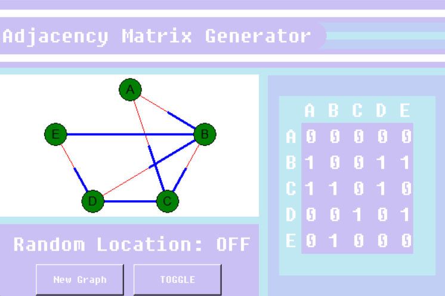
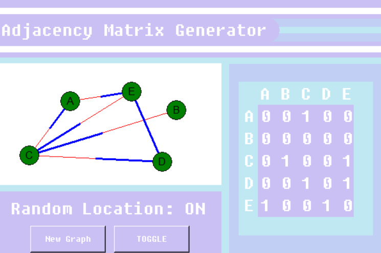

# Adjacency Matrix With Directed Graph

 A program that creates a randomly generated adjacency matrix along with a matching directed graph of the matrix.

## Table of Contents
- [About](#about)
- [Getting Started](#getting_started)
- [How to Use](#usage)
- [Authors](#authors)
## About 
This program was created in order to build up my programming skills in Python and in GUI bulding with TKinter. This project also helped with improving my ability to understand how to read an adjacency matrix.
## Getting Started 
What you will need to run this program: 
- <em>Python</em>- To run this program, you must have some way to run a .py file. Also, this program was written using python 3.8.3, and has not been tested using any other version.
## How to Use 
After installing and adding everything necessary, all you need to do is run the program, choose whether or not you want random node locations, and then press the new graph button to create both the adjacency matrix and directed graph. If a blue part of a line touches a node, it means that you can move along that line to the other node. If a red part of a line touches a node, it means that you cannot move along that line to the other node. An entirely blue line means both nodes touching the line can move on it.

NOTE: Due to how random locations on nodes can sometimes lead to a difficulty in understanding the graph, if this happens, simply ask for the program to give you a new graph or use the random locations toggle to switch off random locations to make readability easier.
## Author 
[@AlexHettle](https://github.com/AlexHettle) - Sole author of project
